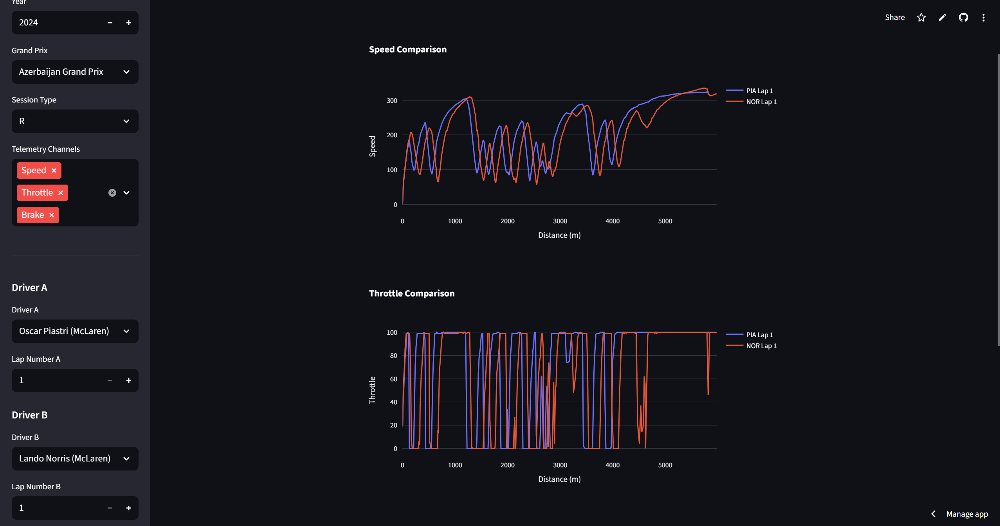

# F1 Comparative Telemetry Tool

This project is an interactive Streamlit app that lets you compare Formula 1 drivers’ telemetry data lap-by-lap.
It uses the [FastF1](https://theoehrly.github.io/Fast-F1/) Python library to fetch official F1 timing data and visualizes it with **Plotly**.

-----

## 🚀 Features

  - Select any **season (2018–2025)** and available **Grand Prix**.
  - Choose session type: `FP1`, `FP2`, `FP3`, `Q`, or `R`.
  - Compare two drivers’ laps side by side.
  - Plot telemetry channels such as:
      - Speed
      - Throttle
      - Brake
      - Gear shifts
  - Interactive, real-time plots powered by **Plotly**.
  - Filters out **future races** (not yet happened).

-----

## 🛠️ Tech Stack

  - **[Streamlit](https://streamlit.io/)** – for the interactive web app.
  - **[FastF1](https://theoehrly.github.io/Fast-F1/)** – for Formula 1 telemetry and session data.
  - **Plotly** – for interactive charting.
  - **Pandas & Numpy** – for data handling and analysis.

-----

## 📂 Project Structure

```
├── main.py              # Main Streamlit app
├── telemetry.py         # Functions to load telemetry data
├── plots.py             # Functions to generate comparison plots
├── utils.py             # Helper setup utilities
├── requirements.txt     # Python dependencies
└── README.md            # Documentation
```

-----

## ⚙️ Installation

1.  Clone this repository:
    ```bash
    git clone https://github.com/Prithyangaa/f1-telemetry.git
    cd f1-telemetry
    ```
2.  Create a virtual environment (recommended):
    ```bash
    python -m venv venv
    source venv/bin/activate       # On macOS/Linux
    venv\Scripts\activate          # On Windows
    ```
3.  Install dependencies:
    ```bash
    pip install -r requirements.txt
    ```

## Usage

Run the app with:

```bash
streamlit run main.py
```

Then open the provided localhost URL in your browser.

## 📊 Example Workflow

1.  Choose a year (e.g., 2023).
2.  Select a Grand Prix that has already happened.
3.  Pick a session type (Qualifying or Race are the most fun).
4.  Choose Driver A and Driver B from the dropdowns.
5.  Select lap numbers.
6.  Click `Compare Laps` → The app generates side-by-side telemetry plots.

-----

## 📸 Demo Screenshots



-----

## 📖 How It Works

  - The app fetches event schedules using FastF1.
  - Future races are automatically filtered out to avoid errors.
  - When a session is loaded, all available drivers are listed.
  - Laps for the selected drivers are extracted, and telemetry data is retrieved.
  - Plotly visualizes lap data, making it easy to compare driver performance.

-----

## ✅ To-Do / Future Improvements

  - Add support for sector time comparison.
  - Include DRS and ERS usage data.
  - Option to export plots as images/PDFs.
  - Add dynamic color effects for downforce/drag zones (aero simulator mode).

-----

## 📚 References

  - [FastF1 Documentation](https://theoehrly.github.io/Fast-F1/)
  - [Streamlit Documentation](https://docs.streamlit.io/)
  - [Plotly Python Graphing Library](https://plotly.com/python/)

-----

## 🏁 Author

Built by Prithyangaa Senthil
If you like this project, ⭐ the repo and share it with fellow F1 fans\!
